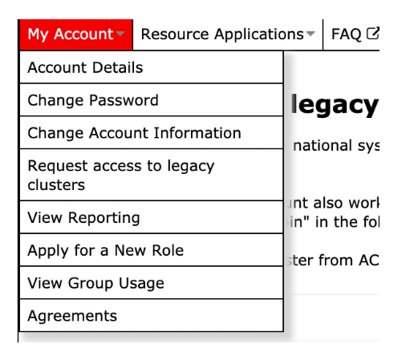

# HOW TO ACCESS COMPUTE CANADA RESOURCES

● Start by creating an account on:
https://www.computecanada.ca/research-portal/account-management/apply-for-an-account/
● While creating your account you will need to provide the CCRI of Erick which is:
iee-073-01
Erick will then receive an email to approve your membership.
● One, your account is approved (which takes a few minutes for someone to approve.
Could depend on the time of the day) you could then first login and then apply for access to Niagara cluster (a cloud) by clicking on “Request access to legacy clusters”.

  Click here on Request access to Niagara and Mist
You click on the “Join” button to get a membership.
They say it takes between 1 and 2 days to have your account created. In my case it only took 3 hours to receive the confirmation email. So, it is quick.
You will then finally be able to use the resources.
● You should have some minimal understanding of the Linux operating system to be able to use its bash system to use the command line.
● Niagara uses SLURM as its job scheduler. SLURM is a software that, once installed (already installed and you don’t have to install it), enables several other commands on the bash terminal. Example of the commands:
■ $ ​sbatch​ launch_script.sh -- This is to launch your scripts on the cloud. You have to specify the resources needed, load all packages needed, move to specific directories on the linux system, and launch your command with ​srun​ followed by your normal way of launching your script. (e.g. srun python your_python.py --my_param param). All these commands should be specified inside the launch_script.sh script which you have to create.
 
 ■ $​ scancel​ 88000 (replace 88000 with the ID of your running job on the cluster to cancel it).
■ squeue --user YOUR_ID (to see all your running or awaiting jobs on the cluster).
● According to Compute Canada, it is preferable to use virtualenv to create your virtual environment instead of conda.
● Those are 2 links that contain almost everything you need to know on how to login to Niagara nodes (servers) via terminal (bash terminal), and how to launch your jobs (scripts) via sbatch:
■ https://docs.scinet.utoronto.ca/index.php/Niagara_Quickstart
■ https://docs.scinet.utoronto.ca/index.php/Niagara_Quickstart#Submitting_
jobs
● To move your data to Niagara nodes, you could move them through command line via scp (e.g. scp myfile.py ​yourlogin@niagara.scinet.utoronto.ca​:PATH_ON_NODE) or rsync on command line. You could also use FileZilla or other FTP clients on your local machines to transfer files.
Here is an example of how I transfered launch_script file from my personal computer to Niagara node:
    Where you should replace fathanab with your own user id.
● Under Niagara, all open source software is available and could be installed. There is
also the possibility to install commercial software such as MATLAB, all you need is a
licence. They could also help you install it if you provide a licence).
● To login:

  ● Example of creating a script launch_script.sh and running a python file through it using sbatch​.
#!/bin/bash
#SBATCH --job-name=RLTest
#SBATCH --mail-user=abderrahim.fathan@gmail.ca #SBATCH --ntasks=1
#SBATCH --mem-per-cpu=2G
#SBATCH --cpus-per-task=1
#SBATCH --output=/scratch/e/edelage/fathanab/output.txt #SBATCH --time=1:00:00
#SBATCH --gres=gpu:TitanX:1
srun python python_test.py
Once you run: $ ​sbatch launch_script.sh
It will run your python_test.py file and it’s output will be logged in the output.txt file. You could of course customize it, and save results (figures, arrays) using other commands.

In the above ● ●
● ● ●
Once sbatch
file:
RLTest will be the name of my task (arbitrary value).
Provide your email to receive notification once your script finishes running.
You provide how many tasks and how much memory per task and how many CPUs to use per task.
--time is for the time allowed for your script to run, otherwise it will be 15 minutes by default and your script will be stopped.
You could also request to use a gpu: Its type and how many.
run and during execution of your task, you could check its status:
 You could also check the intermediate results and output of your commands logged in output.txt
Example of other commands possible:
○ $ srun jupyter nbconvert --ExecutePreprocessor.timeout=-1 --to notebook
--inplace --execute test_srun.ipynb
○ $ srun python autoencoder.py
/lu/bf_scratch/multi/datasets/Agriculture-Vision/agri_v3.hdf5 /lu/fast_scratch/multi/landryda/data/agri/runs/autoencoder-labeller/$RUN_NAME -n-epoch 20 -batch-size 2 -image-every-n 50 -learning-rate-labeller 1e-2 -learning-rate-encoder 1e-2 -batch-limit 50

# Access to Special Software

The use of commercial software such as Matlab, Cplex, or Gurobi is also possible and not difficult to use.

Here's some links provided by Compute Canada for each one of them:
- Matlab: You could use Octave, free and open source, to execute your Matlab code, described in this [link](https://docs.scinet.utoronto.ca/index.php/Octave). Or you can use Matlab directly by compiling your code and copying the executables into Niagara and running them there, or use your License information to execute the Matlab code directly. Everything is described in this [link](https://docs.scinet.utoronto.ca/index.php/MATLAB). This [link](https://docs.scinet.utoronto.ca/index.php/SSH_Tunneling) could also be useful for you to tunnel to your license server.
- Gurobi: Described [here](https://docs.scinet.utoronto.ca/index.php/Gurobi).
- Cplex: Instructions [here](https://docs.computecanada.ca/wiki/CPLEX/en).

In case you need technical assistance or you don't find your available version, you could contact the Niagara/Compute Canada support teams to have it installed for you: 

support@scinet.utoronto.ca
niagara@computecanada.ca

