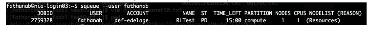

# HOW TO ACCESS COMPUTE CANADA RESOURCES

- Start by creating an account on:
https://www.computecanada.ca/research-portal/account-management/apply-for-an-account/
- While creating your account you will need to provide the CCRI of your sponsor/faculty member (Erick's CCRI is:
iee-073-01)
your sponsor/Erick will then receive an email to approve your membership.
- Once your account is approved (which takes a few minutes for someone to approve.
Could depend on the time of the day) you could then first login and then apply for access to Niagara cluster (a cloud) by clicking on “Request access to legacy clusters”.

    

    

    Click here on Request access to Niagara and Mist
      

    You click on the “Join” button to get a membership.
    They say it takes between 1 and 2 days to have your account created. In my case it only took 3 hours to receive the confirmation email. So, it is quick.
    You will then finally be able to use the resources.
    
    Note that this will also automatically grant you access to other clusters such as Cedar, Graham, or Béluga.

- You should have some minimal understanding of the Linux operating system to be able to use its bash system to use the command line.

- Niagara uses SLURM as its job scheduler. SLURM is a software that, once installed (already installed and you don’t have to install it), enables several other commands on the bash terminal. 

- Example of some useful commands:
    - $ **sbatch** launch_script.sh (This is to launch your scripts on the cloud. You have to specify the resources needed, load all packages needed, move to specific directories on the linux system, and launch your command with **srun** followed by your normal way of launching your script. (e.g. srun python your_python.py --my_param param). All these commands should be specified inside the launch_script.sh script which you have to create.)
    - $ **scancel** 88000 (replace 88000 with the ID of your running job on the cluster to cancel it).
    - $ **squeue** --user YOUR_ID (to see all your running or awaiting jobs on the cluster).
    - $ **scontrol** show jobid -dd your_jobid (Lists detailed information for a job (useful for troubleshooting)).
    - $ **squeue** -u <username> -t RUNNING (Lists all running jobs for a user).
    - $ **squeue** -u <username> -t PENDING (Lists all pending jobs for a user).
    
- According to Compute Canada, it is preferable to use virtualenv to create your virtual environment instead of conda. Using conda on compute Canada is possible but often presents difficulties to use and is not optimised.
- This link contain almost everything you need to know on how to login to Niagara nodes (servers) via terminal (bash terminal), and how to run your jobs (scripts) via sbatch:
    - [Niagara Quickstart](https://docs.scinet.utoronto.ca/index.php/Niagara_Quickstart).
    
- To move your data to Niagara nodes, you could move them through command line via scp (e.g. **scp** myfile.py your_username@niagara.scinet.utoronto.ca:PATH_ON_NODE) or **rsync** on command line. You could also use FileZilla or other FTP clients on your local machines to transfer files.

    Here is an example of how I transfered launch_script file from my personal computer to Niagara node:
    
    
    Where you should replace fathanab with your own username.
- Under Niagara, all open source software is available and could be installed. There is
also the possibility to install commercial software such as MATLAB, all you need is a licence. They could also help you install it if you provide a licence).
- To login:

    
    
  To login on Cedar: **ssh** -Y username@cedar.computecanada.ca
  
  To login on Niagara: **ssh** -Y username@niagara.scinet.utoronto.ca
    
- Before you start using any cluster, make sure to use the right cluster for your needs:
    - **Niagara** accepts jobs of up to 24 hours run-time
    - **Béluga** up to 7 days.
    - **Cedar** and **Graham** up to 28 days.
    
  According to our experience, we would recommend using Cedar or Graham over Niagara, as these clusters have an easier and less restrictive environment for development.
    
- A good practice is to have your working files in the $SCRATCH directory. Submitting jobs from directories residing in /home is not permitted. Transfer your files to a directory in /scratch or /project and submit jobs from there.
    
- Example of creating a script launch_script.sh and running a python file through it using **sbatch**. This script is set up to run on Beluga.

        #!/bin/bash
        #SBATCH --job-name=RLTest
        #SBATCH --mail-user=your_email
        #SBATCH --account=rrg-adulyasa #use either rrg-adulyasa (Beluga), rrg-edelage (Cedar), or def-edelage (others)
        #SBATCH --ntasks=1
        #SBATCH --mem-per-cpu=2G
        #SBATCH --cpus-per-task=1
        #SBATCH --output=/scratch/e/edelage/fathanab/output.txt 
        #SBATCH --time=1:00:00
        #SBATCH --gres=gpu:TitanX:1
        srun python python_test.py

Once you run: $ **sbatch launch_script.sh**
It will run your python_test.py file and its output will be logged in the output.txt file. You could of course customize it, and save results (figures, arrays) using other commands.

- In the above file:
    - RLTest will be the name of my task (arbitrary value).
    - Provide your email to receive notification once your script finishes running.
    - You provide how many tasks and how much memory per task and how many CPUs to use per task.
    - --time is for the time allowed for your script to run, otherwise it will be 15 minutes by default and your script will be stopped.
    - You could also request to use a gpu: Its type and how many.
    
Once sbatch run and during execution of your task, you could check its status:

You could also check the intermediate results and output of your commands logged in output.txt

- Example of other commands possible depending on your use case:
    - $ **srun** jupyter nbconvert --ExecutePreprocessor.timeout=-1 --to notebook --inplace --execute test_srun.ipynb
    - $ **srun** python autoencoder.py
    $SCRATCH/model.hdf5 $SCRATCH/autoencoder-labeller/$RUN_NAME -n-epoch 20 -batch-size 2 -image-every-n 50 -learning-rate-labeller 1e-2 -learning-rate-encoder 1e-2 -batch-limit 50
    
# Useful Commands/Tips

- For easy access with ssh (password-less access):

        $ ssh-keygen #To generate your keys
        $ ssh-copy-id username@niagara.scinet.utoronto.ca #To copy your key to the remote server
  
  You can now use ssh without having to enter a password.
  
- Using Tensorflow:

        $ module load python/3.6
        $ virtualenv $HOME/jupyter_py3
        $ source $HOME/jupyter_py3/bin/activate
        $ pip install --no-index tensorflow_gpu # you could specify your specific version here
        $ pip install jupyter notebook #Optional for useful use of jupyter remotely (Debug, etc.)
        $ echo -e '#!/bin/bash\nunset XDG_RUNTIME_DIR\njupyter notebook --ip $(hostname -f) --no-browser' > $VIRTUAL_ENV/bin/notebook.sh
        $ chmod u+x $VIRTUAL_ENV/bin/notebook.sh
        
  On Niagara cluster, if you still need to use conda or you experience problems using Tensorflow or using a specific version that is unavailable with pip, you could load Conda and install tensorflow:
  
        $ module load anaconda3
        $ conda create -n tfenv python=3.6
        $ conda activate tfenv
        $ conda install -c https://public.dhe.ibm.com/ibmdl/export/pub/software/server/ibm-ai/conda/ tensorflow-gpu==1.14.0
        $ echo ". /scinet/niagara/software/2018a/opt/base/anaconda3/2018.12/etc/profile.d/conda.sh" >> ~/.bashrc # You may need to adapt to your own path
        $ locate ~/.bashrc # Optional: If ever you need to locate your bashrc file.
        
- Start a jupyter session:

        $ salloc --time=3:0:0 --ntasks=1 --cpus-per-task=2 --mem-per-cpu=1024M --account=def-edelage srun $VIRTUAL_ENV/bin/notebook.sh
        
- Start a ssh tunnel to connect to jupyter notebook:

        $ sshuttle --dns -Nr username@cedar.computecanada.ca
        
  Now you can go to your browser and use the http address of your session.
  
- Example of slurm files to run a jupyter notebook and a python file:

  On Cedar (no use of conda):
  
        #!/bin/bash
        #SBATCH --gres=gpu:v100l:1        # request GPU, here V100
        #SBATCH --cpus-per-task=8   # maximum CPU cores per GPU request: 6 on Cedar, 16 on Graham.
        #SBATCH --mem=0               # Request the full memory of the node
        #SBATCH --account=rrg-edelage
        #SBATCH --job-name=Name_of_your_task
        #SBATCH --mail-user=Your_email
        #SBATCH --mail-type=ALL
        #SBATCH --ntasks=1
        #SBATCH --time=27-13:00      # time (DD-HH:MM)
        #SBATCH --output=$SCRATCH/outputs/%N-%j.out  # %N for node name, %j for jobID

        export OMP_NUM_THREADS=$SLURM_CPUS_PER_TASK
        
        source $HOME/jupyter_py3/bin/activate

        cd $SCRATCH/Your_project_folder
        
        srun jupyter nbconvert --ExecutePreprocessor.timeout=-1 --to notebook --inplace --execute your_jupyter_file.ipynb

  On Niagara (use conda tfenv on top of your virtual environment):
  
        #!/bin/bash
        #SBATCH --job-name=Your_test
        #SBATCH --mail-user=Your_email
        #SBATCH --ntasks=1
        #SBATCH --mem-per-cpu=2G
        #SBATCH --cpus-per-task=1
        #SBATCH --output=/scratch/e/edelage/username/output_%N-%j.txt
        # #SBATCH --gres=gpu:TitanX:1

        module load anaconda3

        source /home/e/edelage/username/.bashrc

        source /home/e/edelage/username/tensorflow/bin/activate
        conda activate tfenv
        
        cd $SCRATCH #Choose your working directory

        export LD_LIBRARY_PATH=$LD_LIBRARY_PATH:/home/e/edelage/username/.conda/envs/tfenv/lib

        srun python $SCRATCH/tensorflow-test.py
        
 - On Niagara, it is possible to have easy access to your files and modify/execute them through jupyter via this link: https://jupyter.scinet.utoronto.ca
 
   You will first have to create a symbolic link to your $SCRATCH folder by executing the following command:
   
        $ ln -sT $SCRATCH $HOME/scratch
        
 - Compress/Extract compressed directory:
 
        $ tar -czvf file.tar.gz directory # To compress directory into file.tar.gz
        $ tar xvzf file.tar.gz # To extract file.tar.gz
        $ tar -xvf file.tar.bz2 # To extract file.tar.bz2
        
 - Useful links:
    - [Getting started with Compute Canada](https://docs.computecanada.ca/wiki/Getting_started)
    - [Getting started with Slurm](https://docs.computecanada.ca/wiki/Using_GPUs_with_Slurm)
    - [Using modules](https://docs.scinet.utoronto.ca/index.php/Using_modules)
    - [Using Jupyter](https://docs.computecanada.ca/wiki/Jupyter)
    - [Using Cedar](https://docs.computecanada.ca/wiki/Cedar)
    - [Running jobs on Slurm](https://docs.computecanada.ca/wiki/Running_jobs)
    - [Details about srun](https://slurm.schedmd.com/srun.html)
    - [Getting started with Niagara](https://docs.computecanada.ca/wiki/Niagara_Quickstart)
    - [Using Jupyter Hub](https://docs.scinet.utoronto.ca/index.php/Jupyter_Hub)
    - [Using Tensorflow on CC](https://docs.computecanada.ca/wiki/TensorFlow)
    - [Getting started with Mist](https://docs.scinet.utoronto.ca/index.php/Mist#TensorFlow_and_Keras)
        

# Setting up a virtual environment for python and running a job on GPU

For users that want to use python for their projects, it is recommended to first install a virtual environment, install their required packages in this environment, and then run their jobs. Here is the instruction for creating a virtual environment using python 3.6:

    - Move to the main directory of your user account in computecanda
    - Load python 3.6 on the server by using this command: module load python/3.6
    - Create the virtual environment by using this command: virtualenv --no-download ~/userenv36  (Note that you can choose another name instead of userenv36 for your environment)
    - Activate the virtual environment by using this command: source ~/userenv36/bin/activate
    - Upgrade pip by using this command: pip install --no-index --upgrade pip
    - Whenever needed you can deactivate the virtual environment using this command:deactivate 

After creating the virtual environment, you can install different packages you need without affecting the libraries that are installed on the main server. In order to install different libraries you can simply activate the virtual environment that you just created and then use pip to install them. Here is an example to install pandas: pip install pandas

Note that all your files should be put in the directory "scratch"

It is recommended to use Github for transferring files to computecanda. The benefit of doing so is that every time you make a change in your project you can simply replace the new files with old ones in computecanada by running a script that downloads your files from github. Here is the instruction for downloading a github project on your local computer on windows, making changes in the project, and then updating the project in computecanada:

    - Download and install the git bash app from this link: https://git-scm.com/downloads
    - Create a directory in your local computer for the specific project that you want to download.
    - Go to the github page of the project and copy the url. For example we can download the current project by using this url: https://github.com/erickdelage/CRCDMU_public
    - Change the current directory to the newly created one and choose "Git bash here" from the right click menu so the command window opens up.
    - Type "git clone https://github.com/erickdelage/CRCDMU_public.git"
    - This will download the project into the created directory
    - In order to create the same project in compute canada, move to the "scratch" folder, and run the same command there. This will download the same project in computecanada.
    - Now you can make changes into different files of the project including .py files.
    - Now you need to commit the changes you have already made into the github. To do so, type the following commands in order:
    -   git add .
    -   git commit -m "update python"
    -   git push origin master
    - Now we can update the project in computecanada.
    - Move to the directory where this prject is downloaded in computecanada and run the following command: git pull origin master
    - This command will update the project in computecanada according to the changes you made in your local computer.

Finally here is an example of a .sh file that will run a job on GPU. We assume in the project that you have downloaded into your computecanada account in "scratch" there is a runModel.py file that runs your project:

    #!/bin/bash
    #SBATCH --job-name=RLTest
    #SBATCH --mail-user=user@hec.ca
    #SBATCH --ntasks=1
    #SBATCH --mem-per-cpu=8G
    #SBATCH --cpus-per-task=1
    #SBATCH --output=output.txt
    #SBATCH --time=1:00:00
    #SBATCH --gres=gpu:p100:1
    module load python/3.6
    source ~/userenv36/bin/activate
    srun python runModel.py

# Access to Special Software

The use of commercial software such as Matlab, Cplex, or Gurobi is also possible and not difficult to use.

Here's some links provided by Compute Canada for each one of them:
- Matlab: You could use Octave, free and open source, to execute your Matlab code, described in this [link](https://docs.scinet.utoronto.ca/index.php/Octave). Or you can use Matlab directly by compiling your code and copying the executables into Niagara and running them there, or use your License information to execute the Matlab code directly. Everything is described in this [link](https://docs.scinet.utoronto.ca/index.php/MATLAB). This [link](https://docs.scinet.utoronto.ca/index.php/SSH_Tunneling) could also be useful for you to tunnel to your license server.
- Gurobi: Described [here](https://docs.scinet.utoronto.ca/index.php/Gurobi).
- Cplex: Instructions [here](https://docs.computecanada.ca/wiki/CPLEX/en).

- In case you need technical assistance or you don't find your available version, you could contact the Niagara/Compute Canada support teams to have it installed for you: 
    - support@scinet.utoronto.ca
    - niagara@computecanada.ca

